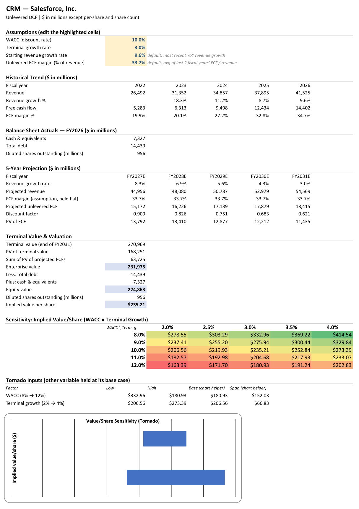
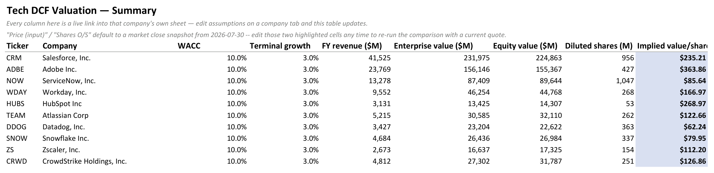
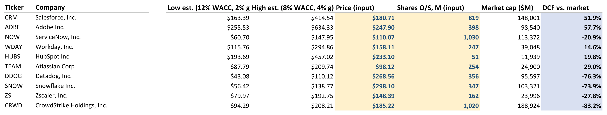

# Tech DCF Valuation (SaaS/Cloud Software)

A discounted cash flow valuation model built in Python against real SEC EDGAR
financial data for **Salesforce, Adobe, ServiceNow, Workday, HubSpot,
Atlassian, Datadog, Snowflake, Zscaler, and CrowdStrike** — 10 SaaS/cloud
companies chosen to span mature/profitable (Adobe, Salesforce) to
still-scaling/thin-margin (Snowflake, Datadog, CrowdStrike), deliberately
stress-testing the model across a wide range of growth and margin profiles.
The output is a real, editable Excel workbook — one live-formula DCF per
company, a WACC x terminal-growth sensitivity grid with a tornado chart on
each tab, and a Summary sheet comparing every company's DCF-implied equity
value against its actual market cap.

The dataset spans fiscal years 2006–2026 (137 company-years across annual
10-K filings).

## Tech stack

- **Python** (`requests`) — pulling and caching raw SEC EDGAR filings
- **openpyxl** — writing the Excel model with live formulas, conditional
  formatting, and native charts (not just pasted-in numbers)
- **SEC EDGAR XBRL API** — source data
- **Excel** — the deliverable

## The model

Each company gets its own tab: editable assumptions, a 5-year historical
trend, the most recent balance sheet actuals, a 5-year projection, terminal
value and valuation, a WACC x terminal-growth sensitivity grid (color-scaled
red to green), and a tornado chart showing how much each variable alone
swings the implied value per share. Editing any of the four highlighted
assumption cells (WACC, terminal growth, starting growth rate, FCF margin)
recalculates everything below it, including the sensitivity grid — every
one of its 25 cells is its own self-contained formula, not a cached
snapshot (see [Modeling approach](#modeling-approach) for why that
required a closed-form workaround).



The Summary sheet links every company sheet together:



...and adds a live market-cap comparison — the "Price" and "Shares O/S"
columns are editable inputs, seeded with a market-close snapshot:



## Data schema

**`data/processed/companies.csv`**

| column | notes |
|---|---|
| cik | SEC Central Index Key |
| ticker | |
| company_name | |
| sector | `SaaS / Cloud Software` for all 10 |

**`data/processed/dcf_financials.csv`** — one row per company per fiscal year

| column | notes |
|---|---|
| cik | FK -> companies |
| fiscal_year | derived from period_end_date, not the filing's self-reported label — see Data Quality Notes |
| period_end_date | |
| revenue | |
| operating_income | GAAP EBIT — negative for several companies; see Modeling approach for why it isn't the FCF driver |
| net_income | |
| income_tax_expense, pretax_income | inputs to effective_tax_rate |
| effective_tax_rate | computed; extremely noisy for this company set — see Modeling approach |
| interest_expense | |
| depreciation_amortization, capex, operating_cash_flow | |
| free_cash_flow | computed: operating_cash_flow − capex |
| cash_and_equivalents, short_term_debt, long_term_debt | |
| total_debt | computed: short_term_debt + long_term_debt |
| diluted_shares_outstanding | |
| filing_date | |

**`data/processed/filings_metadata.csv`** — every (form, filing date,
accession number) triple seen in the raw data, so any number above is
traceable back to the actual 10-K on EDGAR (433 rows).

## Repository structure

```
/data/raw/           <- cached raw EDGAR JSON (one file per ticker)
/data/processed/      <- cleaned CSVs (dcf_financials, companies, filings_metadata) + data quality audit log
/scripts/             <- fetch_data.py, clean_data.py, build_dcf_model.py
/output/              <- tech_dcf_valuation.xlsx (the deliverable)
/docs/                <- README screenshots
README.md
```

## Modeling approach

Revenue is projected forward 5 years with growth fading linearly from each
company's most recent YoY growth rate to a 3% terminal rate. Free cash flow
is modeled as `revenue x FCF margin` (margin held flat, defaulted to the
average of the last 2 fiscal years) rather than the textbook
EBIT*(1-tax)+D&A-capex-ΔNWC buildup — heavy stock-based comp pushes GAAP
operating income negative for half this group in recent years, and
near-zero pretax income makes reported effective tax rates swing wildly
(Salesforce 68%, Workday -288%, CrowdStrike -27% in the cleaned data), so
neither is usable as a DCF input. FCF margins, by contrast, cluster in a
believable 20-40% band across the whole group. Every projected year is
discounted at a single assumed 10% WACC (a deliberate simplification, not
company-specific CAPM/beta) back to a present value, terminal value is
added via the Gordon growth method, and enterprise value bridges to equity
value using each company's most recent cash and total debt (including
convertible notes, which several of these companies use instead of
conventional term debt).

The sensitivity grid can't reuse the main projection's formulas, because
growth in that projection depends on terminal growth too (it's the fade
target) — so revenue at any future year is a function of whichever terminal
growth value the grid cell is testing, not just the year index. Each of the
25 grid cells is instead a self-contained closed-form formula that inlines
the same fade/discount/terminal-value logic for one (WACC, terminal growth)
point at a time. (openpyxl also has no support for real Excel What-If Data
Tables — the `TABLE()` array formula — so this closed-form expansion is
what makes the grid live instead of a one-time snapshot of Python-computed
numbers.) Verified by loading the actual generated file through a formula
evaluation library and confirming the grid's center cell — 10% WACC, 3%
terminal growth — matches the main model's independently-computed value to
13 significant digits.

## Market comparison (as of 2026-07-30)

The Summary sheet compares each company's DCF-implied **equity value** (not
per-share price) against its **market cap** at the snapshot price and share
count — comparing totals rather than per-share figures sidesteps a real
wrinkle in this data: CrowdStrike did a stock split the week of this
snapshot, so its post-split share count (~1.02B) doesn't match the diluted
share count reported in its FY2026 10-K (250.6M), which predates the split.
Market cap and DCF equity value are both share-count-invariant, so the
comparison holds regardless.

| Ticker | Market cap ($B) | DCF equity value ($B) | DCF vs. market |
|---|---:|---:|---:|
| ADBE | 98.5  | 155.4 | **+58%** |
| CRM  | 148.0 | 224.9 | **+52%** |
| TEAM | 24.9  | 32.1  | +29% |
| HUBS | 11.9  | 14.3  | +20% |
| WDAY | 39.0  | 44.8  | +15% |
| NOW  | 113.4 | 89.6  | -21% |
| ZS   | 24.0  | 17.3  | -28% |
| SNOW | 103.3 | 27.0  | **-74%** |
| DDOG | 95.6  | 22.6  | **-76%** |
| CRWD | 188.9 | 31.8  | **-83%** |

The group splits cleanly into two camps under this model's conservative,
uniform assumptions (10% WACC, 3% terminal growth, 5-year fade, flat FCF
margin, no company-specific risk premium):

- **CRM, ADBE, TEAM, HUBS, WDAY** trade *below* what this base-case DCF
  says they're worth — the market is pricing in less growth (or demanding
  a higher discount rate) than a plain vanilla 10%/3% case would need to
  justify the current price.
- **DDOG, SNOW, CRWD**, and to a lesser extent **NOW** and **ZS**, trade
  *far above* it — the market is pricing in a much longer or steeper
  growth runway than a 5-year fade to 3% captures. CrowdStrike's gap in
  particular (market cap ~6x the DCF equity value) says less "this model
  is right and the stock is wrong" and more "the market is underwriting a
  growth story this model's assumptions were never built to capture."

Two caveats worth being upfront about: (1) this snapshot landed on an
unusually volatile trading day — most of these names moved 4-8% in one
session, several in different directions from each other — so the exact
percentages above are a noisier read on any single day than the *pattern*
across the group; and (2) every number in the "DCF vs. market" column is
only as good as the single uniform WACC/terminal-growth assumption behind
it. That's the point of the sensitivity grids on each company tab: they
show how much of this gap a more aggressive (lower WACC, higher terminal
growth) assumption set could close for the "overvalued" names before
concluding the market is simply wrong.

## Data quality notes

Real EDGAR data is inconsistent in ways that aren't obvious until you
cross-check the numbers against what companies actually reported. Every
decision below is logged, per-row, in
`data/processed/data_quality_log.csv` (226 entries across the dataset) so
any individual number is traceable back to why it looks the way it does.

- **Fiscal year mislabeling.** A tag's very first XBRL appearance often
  bundles several historical years of comparatives into one filing, with
  every comparative period carrying *that filing's own*
  DocumentFiscalYearFocus rather than its own — so the same raw `fy` label
  can legitimately point at two different real periods. Records are
  therefore keyed on `period_end_date`, the one thing every occurrence of a
  real period agrees on, and `fiscal_year` is derived from it afterward
  rather than trusted as reported. An earlier version of this pipeline
  keyed records on the raw `fy` label directly; the mislabeling above made
  it collide on 330 periods, and the guard against that collision — a
  provisional key so one period's data couldn't silently overwrite
  another's — was itself never merged back in, so those periods were
  silently dropped from the output entirely (102 rows instead of the
  correct 137). Caught by cross-checking Salesforce's cleaned revenue
  against its actual reported figures and noticing years were missing;
  fixed by switching the key to `period_end_date`.
- **Restatements.** When the same period_end_date appears more than once —
  a prior-year figure repeated as a comparative in a later 10-K — the value
  from the most recently *filed* occurrence is kept and the discrepancy is
  logged if the value actually changed (134 cases).
- **Tag fallbacks.** Companies vary which XBRL tag they report a concept
  under — most visibly for debt: several of these companies (Snowflake,
  Datadog, Zscaler, HubSpot) funded themselves through convertible notes
  rather than conventional term debt, reporting under tags like
  `ConvertibleDebtNoncurrent` instead of `LongTermDebtNoncurrent`. Each
  field tries a prioritized list of tags and fills gaps *period by period*
  from lower-priority tags (44 cases; most common on `revenue`,
  `long_term_debt`, and `short_term_debt`).
- **Missing concepts.** If a company has no data at all for a field under
  any known tag, it's left `NULL` — never fabricated or interpolated (4
  cases: Snowflake's interest_expense and short_term_debt, CrowdStrike's
  depreciation_amortization and short_term_debt).
- **Partial debt components.** When only one of short-term or long-term
  debt is reported for a given year, `total_debt` treats the missing side
  as $0 rather than leaving the total NULL (44 cases) — the same principle
  the DCF model itself later applies to HubSpot's most recent fiscal year,
  which reports no debt tag at all (see Market comparison above).
- **Units.** Share-count tags (`WeightedAverageNumberOfDilutedSharesOutstanding`)
  are reported under XBRL's `shares` unit, not `USD` — easy to miss, and
  the kind of bug that fails silently (every share count comes back blank,
  not obviously wrong) rather than loudly.

## Reproducing this project

```bash
pip install -r requirements.txt
python scripts/fetch_data.py       # pull + cache raw EDGAR JSON into data/raw/
python scripts/clean_data.py       # clean into data/processed/*.csv
python scripts/build_dcf_model.py  # write output/tech_dcf_valuation.xlsx
```

Then open `output/tech_dcf_valuation.xlsx` in Excel.
